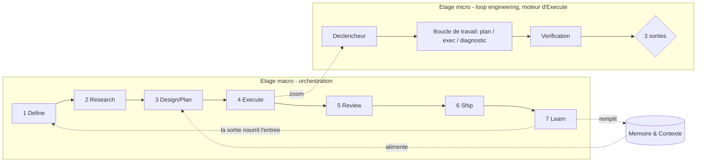

# Workflow agentique — la boucle macro (orchestration)

> **Version** 1.1 · **Date** 2026-07-19
> La couche d'**orchestration** qui entoure le [loop engineering](loop-engineering.md).
> Le loop engineering décrit une **boucle micro** — comment *un agent* livre une tâche finie et vérifiée. Ce document décrit la **boucle macro** — comment *l'humain* conçoit et pilote un projet entier avec des agents. Écrit pour le développement logiciel, mais le schéma se généralise (voir §9).

---

## En une phrase

L'ingénierie agentique tient dans l'emboîtement de **deux boucles, à deux altitudes** :

- **Boucle MACRO — orchestration** : comment *toi*, chef d'orchestre, conçois et pilotes un projet (les 7 étapes ci-dessous).
- **Boucle MICRO — exécution** : comment *un agent* livre une tâche finie et vérifiée, au coût le plus bas. C'est le [**loop engineering**](loop-engineering.md) (voir §5), moteur de l'étape `Execute`.

Le modèle (LLM) devient un composant interchangeable ; la valeur se déplace vers le **harnais** qui l'entoure.

---

## 1. Le changement de posture

La rupture apportée par les LLM tient en un glissement de rôle :

| Avant (opérateur) | Après (chef d'orchestre) |
|---|---|
| Produire | **Superviser** |
| Écrire chaque ligne | **Choisir** entre des propositions |
| Exécuter | **Arbitrer, challenger, prioriser** |
| Vitesse individuelle | **Concurrence intellectuelle** (plusieurs agents en parallèle) |

Un agent = une responsabilité (chercheur, architecte, développeur, testeur, reviewer sécurité…). Cette spécialisation, combinée au parallélisme, revient à consulter plusieurs experts au lieu d'un seul généraliste.

---

## 2. Les deux principes qui rendent le système fiable

### a. La chaîne d'artefacts (le fil rouge)

Chaque étape **produit un fichier versionné**, qui est le *contrat d'entrée* de la suivante :

```
01-brief.md → 02-research.md → 03-plan.md → code+tests → 05-review.md → release → learnings
```

C'est cette chaîne qui empêche les agents de dériver : ils ne travaillent jamais « dans le vide », toujours à partir d'un artefact explicite.

### b. Les gates humains

L'humain n'est indispensable qu'à **5 moments**. Le reste est délégable.

1. **Critères d'acceptation** (fin de Define)
2. **Choix du plan** (fin de Design) — *le plus décisif*
3. **Audit des zones critiques** (dans Review)
4. **Go / No-go** (Ship)
5. **Décision de remédiation** (Learn — tant que l'auto-remédiation n'est pas mûre)

---

## 3. Les deux fondations transversales *(toujours actives)*

Ce ne sont pas des étapes : elles alimentent **tout** le cycle.

### Fondation A — Mémoire & Contexte

Les agents ne devraient **jamais repartir de zéro**. Ils accèdent à :

- décisions passées (ADR), documentation, conventions
- tickets, code existant, incidents précédents

C'est ce qui distingue un agent *utile* d'un agent *générique*. Sans mémoire, chaque cycle réinvente le contexte — et réintroduit les mêmes incohérences. La Mémoire est **remplie par Learn** (étape 7) et **consommée par Research, Design et Execute**.

### Fondation B — Le harnais *(le vrai produit)*

La valeur ne réside plus dans le LLM lui-même. Elle réside dans :

- l'**orchestration** des agents
- l'**accès aux bonnes connaissances** (Fondation A)
- les **garde-fous**
- les **outils** disponibles
- les **points de décision** laissés à l'humain

> L'avantage compétitif, c'est le système d'orchestration — pas le modèle de langage seul. Le modèle est un composant ; le harnais est le produit.

---

## 4. La boucle macro en 7 étapes

### 1 · Define — *cadrer le problème* 🧭 (l'étape la plus humaine)

- **Objectif** : convertir un besoin flou en problème borné et **vérifiable**.
- **Humain fixe** : objectifs · contraintes · **critères de succès testables** · données disponibles · budget (temps / coût / tokens) · risques · périmètre **in / out**.
- **Artefact →** `01-brief.md`
- **Gate** : critères mesurables, aucune ambiguïté bloquante.

> Un agent rapide dans la mauvaise direction reste une erreur — juste plus rapide. Si le brief est mauvais, tout le reste l'est aussi.

### 2 · Research — *explorer le domaine*

- **Objectif** : réduire l'incertitude technique avant de décider.
- **Parallélisme** — 3 agents, 3 angles :
  1. **l'existant** (codebase, conventions actuelles)
  2. **l'écosystème** (build vs buy, bibliothèques, versions, licences)
  3. **les risques** (edge cases, sécurité, dette, perf)
- **Alimenté par** la Mémoire (ADR, incidents passés).
- **Humain** : lit la synthèse, tranche les questions ouvertes.
- **Artefact →** `02-research.md` (synthèse · options · reco · risques · questions ouvertes)
- ⚠️ Vérifier les bibliothèques / API **hallucinées** — ne jamais recommander sans confirmer l'existence réelle.

### 3 · Design / Plan — *comparer plusieurs stratégies* ⭐ (gate décisif)

- **Objectif** : choisir une architecture.
- **Parallélisme** : **3 plans concurrents**, chacun briefé sur les standards du projet.
- **L'humain juge** : respect de l'archi · edge cases anticipés · **découplage** (pas de dette future) · testabilité · **réversibilité** · coût · taille du diff.
- **Artefact →** `03-plan.md` (archi retenue · **découpage en tâches + dépendances explicites** · points de test · plan de rollback)
- **Gate** : validation humaine du plan.

> C'est *ici* qu'on empêche les erreurs coûteuses — pas à la Review. Corriger un plan coûte une phrase ; corriger un merge coûte une journée. Le découpage en tâches réellement indépendantes conditionne toute la parallélisation de l'étape suivante.

### 4 · Execute — *produire en parallèle* ⚙️ (motorisé par le loop engineering, §5)

- **Objectif** : du code conforme au plan.
- **Parallélisme** : agents spécialisés (back / front / tests) **sur les tâches réellement indépendantes uniquement**, avec des frontières définies au plan et des espaces de travail isolés (worktrees) pour éviter qu'ils se marchent dessus.
- **Chaque agent tourne en boucle interne** (essai → diagnostic → correction) jusqu'à sa preuve de succès — c'est l'étage micro du §5.
- **Tests** dérivés des critères d'acceptation, écrits tôt.
- **Humain** : disponible pour débloquer, prépare la feature suivante.
- **Artefact →** code + tests + **journal des écarts** (plan vs réalité).
- ⚠️ « Libère-toi complètement » est optimiste : la parallélisation naïve crée des conflits. Surveiller les agents qui dérivent du plan.

### 5 · Review — *arbitrer humainement* (bien plus que relire du code)

- **Objectif** : valider des **décisions**, pas seulement du code.
- **Deux niveaux** :
  - **Automatique** — sécurité, types, lint, revue de code par agents.
  - **Humain, ligne par ligne**, sur les zones critiques : **auth, paiement, données sensibles, migrations, tout l'irréversible**.
- **Dimensions élargies** : cohérence métier · qualité fonctionnelle · performance · conformité · **coûts** · sécurité · maintenabilité.
- **Artefact →** `05-review.md` (findings + décisions ; **boucle vers Execute** si correction nécessaire).
- **Gate** : zones critiques auditées par un humain.

> On ne relit pas du code : on valide des décisions.

### 6 · Ship — *livrer*

- Merge · déploiement · monitoring initial.
- **Checklist** : migrations · feature flags · **rollback triggers définis AVANT le déploiement**.
- **Artefact →** release notes + runbook.
- **Gate** : go / no-go humain.

### 7 · Learn — *mesurer, observer, améliorer* 🔄 (ferme la boucle)

- **Objectif** : le système apprend ; on revient au **Define**.
- **Entrées** : monitoring · feedback utilisateur · métriques · incidents.
- **Sortie** : décisions, ADR et incidents **écrits dans la Mémoire** → deviennent le contexte du prochain cycle.
- ⚠️ **Maturité** : « un agent alerte un agent qui corrige en prod » est la **cible**, pas l'état actuel. Aujourd'hui : *agent diagnostique → humain décide*. Toute action agentique en prod doit avoir un **périmètre étroit et réversible**.



---

## 5. Le moteur : Loop Engineering *(étage micro)*

> ⚠️ **Ce chapitre est une interface, pas une copie.** La source normative est le document
> [loop-engineering.md](loop-engineering.md) de ce dépôt (Partie A = contrat immuable · Partie B =
> template `LOOP-<projet>.md`, aussi extrait dans [TEMPLATE-LOOP.md](TEMPLATE-LOOP.md)).
> Ne **jamais** re-dupliquer A1–A9 ici : c'est le drift qu'on veut éviter. Ci-dessous, uniquement les points d'accroche.

Là où la boucle macro décrit *comment tu pilotes*, le loop engineering décrit *comment un agent livre* : il ne rend pas une réponse, il rend un **travail fini et vérifié**. C'est le moteur de l'étape `Execute` — et ce qui rend crédibles l'autonomie et le modèle économique.

- **Règle d'or (A2)** : pas de boucle sans **critère de sortie mesurable ET limite de ressources**. On conçoit **en partant de la vérification** — si on ne sait pas écrire le test de succès, on n'écrit pas la boucle.
- **Les 3 blocs (A2)** : Déclencheur · Boucle de travail · Vérification.
- **Le seuil de preuve = 5 éléments (A3)** : Objectif · Outil · Test · Diagnostic · Preuve de succès (binaire). Un élément manque → mode question, la boucle ne démarre pas.
- **Les 3 sorties de boucle (A4)** : Succès (livraison) · Échec assumé (documenté + rollback) · Escalade HITL (enrichit la mémoire).
- **Garde-fous (A5)** : itérations max · temps max · budget · rollback · périmètre de permissions.
- **Observabilité (A6)** : journal de boucle · heartbeat · suivi des coûts.
- **Modèle économique (A8)** : conception avec un modèle de pointe → exécution basculée vers un modèle **10 à 20× moins cher**, sur critère mesurable (ex. ≥ 90 % de succès sur 20 sessions). *La rigueur de la structure compense la puissance moindre du modèle.*

---

## 6. Où les deux boucles se rejoignent

Le loop engineering n'est pas une alternative au workflow macro : il l'**équipe** précisément là où le générique est le plus faible.

| Étape macro | Ce que le loop engineering y apporte |
|---|---|
| **Define** | Les **seuils de preuve** (B3) : traduire une attente floue en test binaire. |
| **Design / Plan** | Les **3 sorties de boucle** et les garde-fous, définis *avant* le lancement. |
| **Execute** | La **boucle de travail** elle-même (essai → diagnostic → correction) + l'observabilité. |
| **Review** | Vérification objective vs subjective ; **escalade HITL** sur toute zone risquée. |
| **Ship · Learn** | La **bascule vers le modèle économique** (A8) + la capitalisation en skills réutilisables. |

---

## 7. Tableau récapitulatif

| # | Étape | Artefact | Gate humain | Maturité |
|---|---|---|---|---|
| 1 | Define | `01-brief.md` | ✅ Critères testables | ✅ Opérable |
| 2 | Research | `02-research.md` | — | ✅ Opérable |
| 3 | Design/Plan | `03-plan.md` | ✅ **Choix du plan** | ✅ Opérable |
| 4 | Execute | code + tests + écarts | — | 🟡 Conflits à surveiller |
| 5 | Review | `05-review.md` | ✅ **Audit critique** | ✅ Opérable |
| 6 | Ship | release + runbook | ✅ Go/No-go | ✅ Opérable |
| 7 | Learn | learnings → Mémoire | ✅ Remédiation | 🔴 Auto-remédiation immature |
| — | *Mémoire & Contexte* | base de connaissances | — | 🟡 À formaliser |
| — | *Harnais* | orchestration + garde-fous | — | 🟡 = le vrai chantier |

---

## 8. Anti-patterns

- **Sauter Define** → vitesse maximale dans la mauvaise direction.
- **Sur-paralléliser des tâches couplées** → conflits de merge, incohérences.
- **Confondre revue automatique et audit humain** des zones critiques.
- **Agents sans mémoire** → contexte réinventé à chaque cycle.
- **Laisser un agent agir en prod** sans périmètre réversible.
- **Faire confiance à une référence externe** sans vérifier son existence (hallucination).
- **Re-dupliquer le contenu du Loop Engineering** dans ce doc → drift entre les deux sources.

---

## 9. Portée au-delà du développement

Le schéma de fond n'est pas propre au code :

> un agent **collecte** l'information → un autre la **structure** → un troisième **propose** → un quatrième **critique** → un humain **tranche**.

Il s'applique aussi bien à l'**analyse de données**, à la **rédaction**, au **conseil**, au **juridique** ou au **marketing**. Ce qui change d'un domaine à l'autre, ce n'est pas la boucle — c'est le harnais (§3.B) : les outils branchés, les connaissances accessibles et les garde-fous.

---

## 10. Par où commencer *(sans sur-outiller)*

1. **Un artefact par étape**, en simples fichiers `.md`. Rien d'autre au départ.
2. **Ajouter le parallélisme** là où le gain est réel d'abord : Research et Design.
3. **Formaliser la Mémoire progressivement** : un dossier `/decisions` + des ADR suffisent pour démarrer.
4. **Automatiser les gates en dernier** — quand le flux manuel est éprouvé.

> Le workflow a de la valeur *avant même* d'être outillé. L'outillage vient consolider un flux qui marche déjà à la main.

---

### Source normative

Pour toute **mise en autonomie** d'un agent, c'est [loop-engineering.md](loop-engineering.md) qui fait foi (Partie A = contrat immuable, Partie B = template par projet, extrait dans [TEMPLATE-LOOP.md](TEMPLATE-LOOP.md)). Le présent document décrit l'étage macro qui l'entoure ; il ne le remplace pas.

*Licence : [CC BY 4.0](LICENSE), comme le reste du dépôt.*
